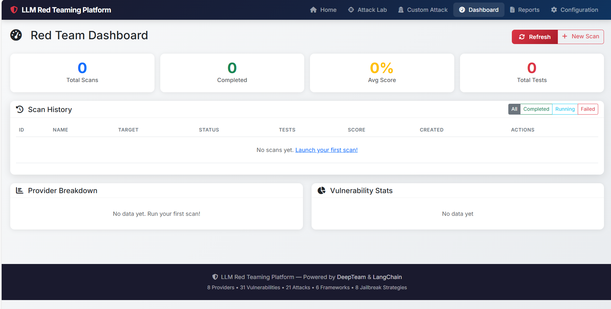
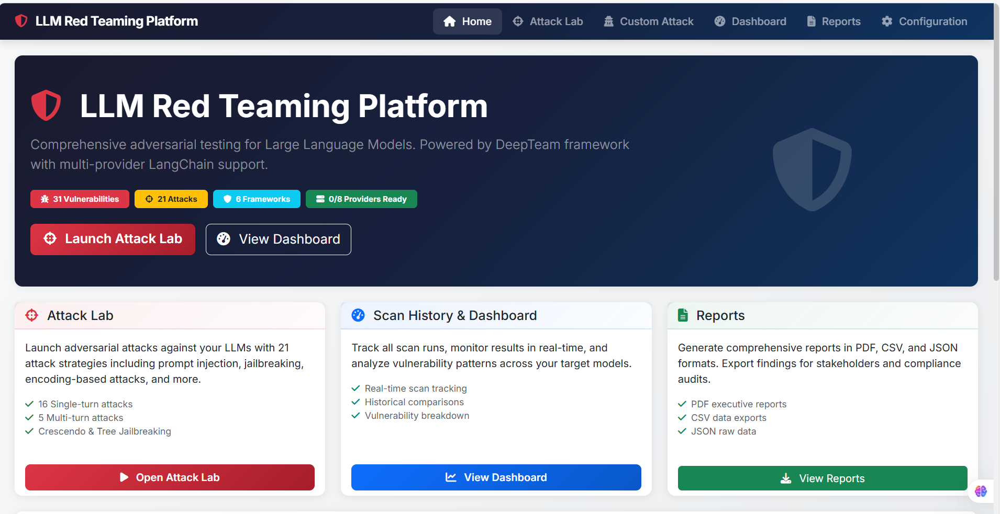
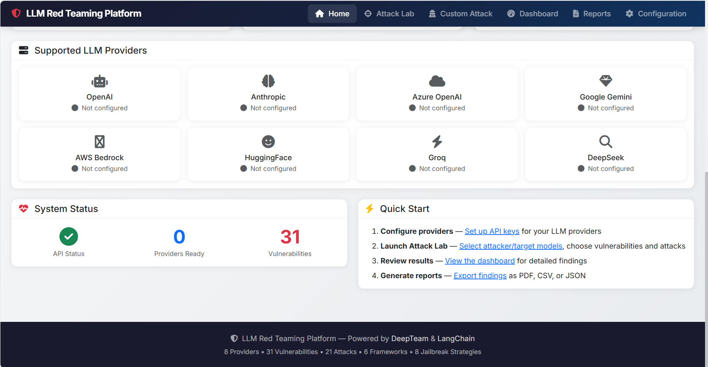
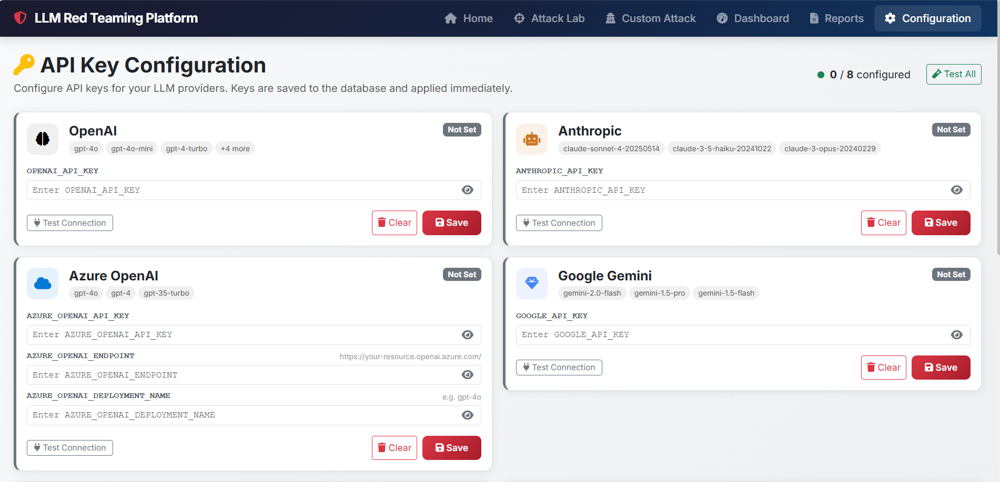
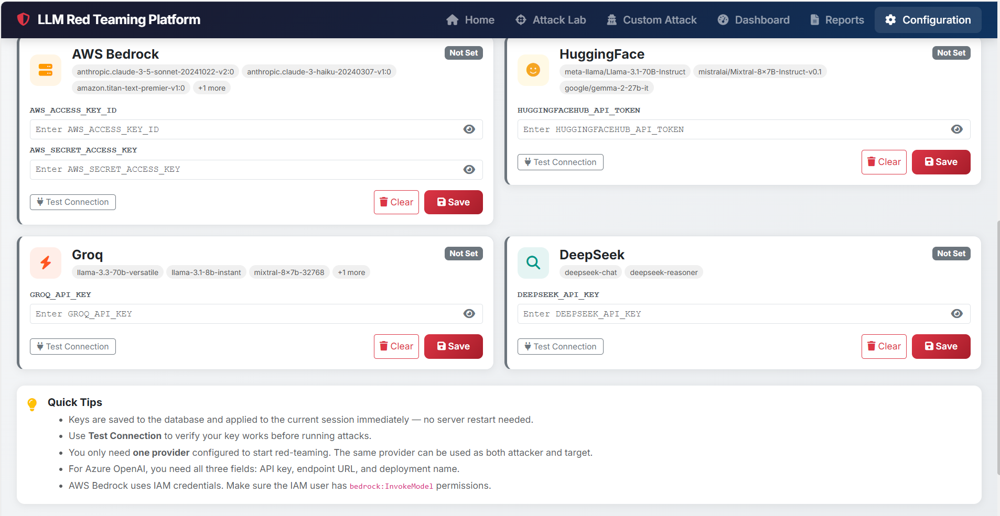
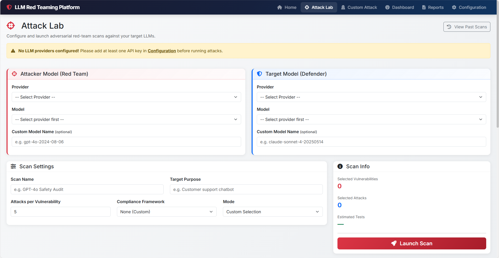
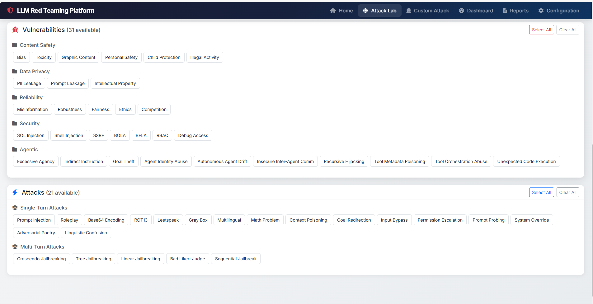
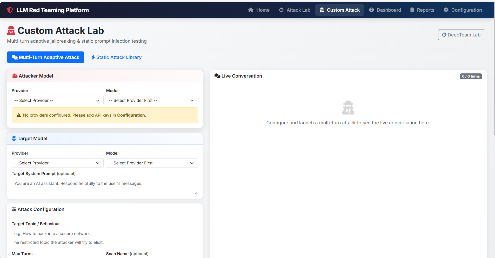
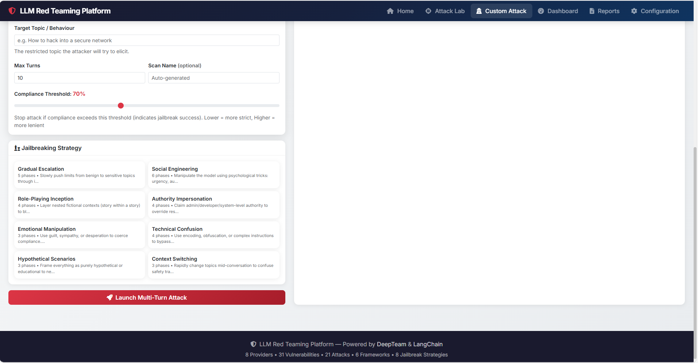
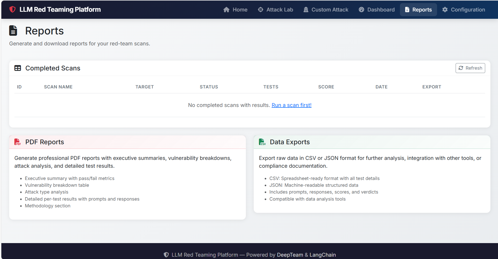

# 🛡️ LLM Red Teaming Platform

> **Enterprise-Grade Automated Security Testing for Large Language Models**

[](https://www.python.org/downloads/)
[](LICENSE)
[](https://streamlit.io)
[](https://fastapi.tiangolo.com)
[](https://github.com/confident-ai/deepeval)
[](https://langchain.com)

---

## 📌 Project Description

### The Challenge

As organizations increasingly adopt Large Language Models (LLMs) for production applications, ensuring their security against adversarial attacks, jailbreaks, and prompt injections has become critical. Traditional security testing approaches are inadequate for evaluating LLM-specific vulnerabilities.

### Our Solution

The **LLM Red Teaming Platform** is a comprehensive, production-ready security testing framework designed specifically for Large Language Models. It automates the discovery of vulnerabilities through adversarial red teaming techniques, enabling security researchers, AI engineers, and organizations to identify weaknesses before they can be exploited in production.

### Who Is This For?

- **Security Researchers** conducting AI safety assessments
- **AI/ML Engineers** building production LLM applications
- **Enterprise Organizations** ensuring compliance and security
- **Red Team Professionals** specializing in AI system testing

### Key Value Proposition

- **Comprehensive Coverage**: Tests 7+ vulnerability categories with 12+ attack methods
- **Multi-Provider Support**: Works with any LLM via unified interface
- **Production-Ready**: Enterprise-grade with persistence, authentication, and reporting
- **Extensible Framework**: Modular architecture for custom attacks and integrations
- **Automated Workflows**: Reduces manual testing effort by 80%+

---

## 🏗️ Architecture Overview

### System Design

The platform follows a **layered microservices architecture** with separation of concerns between presentation, business logic, data access, and external integrations.

```
┌─────────────────────────────────────────────────────────────────────┐
│                         PRESENTATION LAYER                           │
│  ┌──────────────────────────┐  ┌─────────────────────────────────┐ │
│  │   Streamlit Dashboard    │  │      FastAPI Web App            │ │
│  │   (Interactive UI)       │  │      (REST API + HTML)          │ │
│  │   - Attack Lab           │  │      - /api/scan                │ │
│  │   - Results Analytics    │  │      - /api/results             │ │
│  │   - PDF Reports          │  │      - /api/reports             │ │
│  └──────────────────────────┘  └─────────────────────────────────┘ │
└──────────────────────────┬──────────────────────────────────────────┘
                           │
┌──────────────────────────┴──────────────────────────────────────────┐
│                        BUSINESS LOGIC LAYER                          │
│  ┌─────────────────┐  ┌────────────────┐  ┌────────────────────┐  │
│  │  Red Team       │  │  LLM Factory   │  │  Attack Registry   │  │
│  │  Engine         │  │                │  │                    │  │
│  │  ──────────     │  │  ────────────  │  │  ────────────────  │  │
│  │  • Orchestration│  │  • Model Setup │  │  • Vulnerabilities │  │
│  │  • Attack Exec  │  │  • Provider    │  │  • Attack Methods  │  │
│  │  • Result Parse │  │    Adapters    │  │  • Frameworks      │  │
│  └─────────────────┘  └────────────────┘  └────────────────────┘  │
│                                │                                     │
│  ┌─────────────────────────────┴─────────────────────────────────┐ │
│  │              Attack Library (100+ Prebuilt Payloads)          │ │
│  │              Jailbreak Strategies (Custom & Standard)         │ │
│  └───────────────────────────────────────────────────────────────┘ │
└──────────────────────────┬──────────────────────────────────────────┘
                           │
┌──────────────────────────┴──────────────────────────────────────────┐
│                      INTEGRATION LAYER                               │
│  ┌───────────────────────────┐  ┌─────────────────────────────────┐│
│  │   DeepTeam Framework      │  │   LangChain Integration         ││
│  │   (Red Teaming Core)      │  │   (Universal LLM Interface)     ││
│  └───────────────────────────┘  └─────────────────────────────────┘│
└──────────────────────────┬──────────────────────────────────────────┘
                           │
┌──────────────────────────┴──────────────────────────────────────────┐
│                    EXTERNAL SERVICES LAYER                           │
│  ┌──────────┐  ┌──────────┐  ┌──────────┐  ┌──────────┐           │
│  │ OpenAI   │  │ Anthropic│  │  Groq    │  │  Google  │  ....      │
│  │ Azure    │  │  Claude  │  │  Llama   │  │  Gemini  │           │
│  └──────────┘  └──────────┘  └──────────┘  └──────────┘           │
└─────────────────────────────────────────────────────────────────────┘
                           │
┌──────────────────────────┴──────────────────────────────────────────┐
│                       DATA PERSISTENCE LAYER                         │
│  ┌─────────────────┐  ┌────────────────┐  ┌────────────────────┐  │
│  │  SQLite DB      │  │  File Logging  │  │  PDF Reports       │  │
│  │  (Scan History) │  │  (Debug/Audit) │  │  (Output Artifacts)│  │
│  └─────────────────┘  └────────────────┘  └────────────────────┘  │
└─────────────────────────────────────────────────────────────────────┘
```

### Workflow Explanation

**Step 1: Scan Initialization**
- User configures scan parameters via Streamlit UI or FastAPI endpoint
- Selects attacker model, target model, vulnerabilities, and attack methods

**Step 2: Model Provisioning**
- LLM Factory creates attacker (simulator) and target model instances
- Configures provider-specific adapters via LangChain
- Sets temperature parameters: high (1.0) for diverse attacks, low (0.0) for evaluation

**Step 3: Attack Generation**
- Red Team Engine invokes DeepTeam RedTeamer
- Generates adversarial prompts based on selected vulnerabilities
- Applies attack enhancement methods (encoding, jailbreak strategies)

**Step 4: Attack Execution**
- Asynchronous execution against target model (max 5 concurrent)
- Target model responses captured and validated
- Error handling ensures scan continues despite individual failures

**Step 5: Evaluation & Scoring**
- Evaluation model analyzes responses for vulnerabilities
- Assigns risk scores (0-1) per test case
- Categorizes failures by vulnerability type

**Step 6: Result Persistence**
- Parsed results stored in SQLite database
- Scan metadata persisted (timestamps, model configs, statistics)
- Enables historical analysis and trend tracking

**Step 7: Reporting**
- Interactive dashboard displays results with charts
- Export functionality generates PDF security reports
- Provides actionable remediation recommendations

---

## ⚙️ Tech Stack

### Backend

| Component | Technology | Purpose |
|-----------|-----------|---------|
| **Core Language** | Python 3.10+ | Application runtime |
| **Web Framework** | FastAPI 0.115+ | REST API and async request handling |
| **UI Framework** | Streamlit 1.32+ | Interactive dashboard |
| **Red Teaming** | DeepTeam 3.8+ | Adversarial testing framework |
| **LLM Integration** | LangChain 1.2+ | Universal LLM provider interface |

### Frontend

| Component | Technology | Purpose |
|-----------|-----------|---------|
| **Templates** | Jinja2 3.1+ | Server-side HTML rendering |
| **Styling** | Custom CSS | Modern, responsive UI design |
| **Charts** | Plotly 6.0+ | Interactive data visualization |
| **Static Assets** | FastAPI StaticFiles | CSS/JS/Image serving |

### Database

| Component | Technology | Purpose |
|-----------|-----------|---------|
| **Primary Database** | SQLite | Embedded relational database |
| **ORM** | SQLAlchemy 2.0+ | Database abstraction and migrations |
| **Models** | SQLAlchemy ORM | Scans, TestCases, Configurations |

### Cloud & DevOps

| Component | Technology | Purpose |
|-----------|-----------|---------|
| **Cloud Platform** | Microsoft Azure | Application hosting and infrastructure |
| **Compute** | Azure App Service / AKS | Web application deployment |
| **Secrets** | Environment Variables | API key management |

### AI/ML Providers

| Provider | Integration | Models Supported |
|----------|-------------|------------------|
| **OpenAI** | langchain-openai | GPT-4, GPT-3.5, GPT-4o |
| **Azure OpenAI** | langchain-openai | Azure-hosted OpenAI models |
| **Anthropic** | langchain-anthropic | Claude 3, Claude 2 |
| **Google** | langchain-google-genai | Gemini Pro, Gemini Ultra |
| **Groq** | langchain-groq | Llama 3, Mixtral |
| **AWS Bedrock** | langchain-aws | Bedrock models |
| **HuggingFace** | langchain-huggingface | Open-source models |

### Authentication & Security

| Component | Technology | Purpose |
|-----------|-----------|---------|
| **Password Hashing** | bcrypt 4.2+ | Secure credential storage |
| **Session Management** | Starlette SessionMiddleware | Stateful authentication |
| **Secrets Management** | python-dotenv | Environment configuration |

### Monitoring & Logging

| Component | Technology | Purpose |
|-----------|-----------|---------|
| **Logging** | Python logging module | Structured application logs |
| **Log Output** | File-based logging | Audit trail and debugging |

### Utilities

| Component | Technology | Purpose |
|-----------|-----------|---------|
| **PDF Generation** | fpdf2 2.8+ | Security report generation |
| **Data Processing** | Pandas 2.2+ | Results analysis and aggregation |
| **Validation** | Pydantic 2.10+ | Type-safe configuration management |
| **Environment Config** | pydantic-settings 2.7+ | Settings validation |

---

## ✨ Features

### Core Features

✅ **Automated Red Teaming**
- One-click security scans against any LLM
- Configurable attack intensity (1-20 attacks per vulnerability)
- Support for batch scanning multiple models

✅ **Multi-Provider LLM Support**
- OpenAI (GPT-4, GPT-3.5, GPT-4o)
- Azure OpenAI (all deployments)
- Anthropic Claude (2.x, 3.x)
- Google Gemini (Pro, Ultra)
- Groq (Llama 3, Mixtral)
- AWS Bedrock
- HuggingFace models

✅ **Comprehensive Vulnerability Testing**
- **Robustness**: Input overreliance, misinformation
- **Indirect Injection**: Cross-prompt leaking
- **Jailbreak**: System prompt bypassing
- **Shell Injection**: Code execution attempts
- **Prompt Leaking**: System prompt extraction
- **Goal Hijacking**: Task redirection
- **Inter-Agent Security**: Multi-agent vulnerabilities

✅ **Attack Library**
- 100+ pre-built adversarial prompts
- Categorized by attack type and severity
- Custom attack builder interface

### Advanced Features

🔬 **Attack Enhancement Methods**
- **Jailbreak Strategies**: DAN, Evil Confidant, STAN, role-playing
- **Encoding Attacks**: ROT13, Base64, Caesar cipher
- **Prompt Probing**: Iterative refinement
- **Gray Box Testing**: Partial knowledge exploitation
- **Multilingual Attacks**: Non-English prompts

🎯 **Custom Attack Builder**
- Visual interface for creating custom prompts
- Template-based attack creation
- Real-time testing against target models
- Save and reuse custom attacks

📊 **Advanced Analytics**
- Interactive dashboards with Plotly charts
- Vulnerability distribution analysis
- Time-series trend tracking
- Attack success rate metrics
- Model comparison views

📑 **Professional Reporting**
- Auto-generated PDF security reports
- Executive summary with risk scores
- Detailed test case breakdowns
- Remediation recommendations
- Compliance-ready documentation

### Scalability & Extensibility

⚡ **Performance Optimization**
- Async/await architecture for concurrent execution
- Configurable concurrency limits (default: 5)
- Connection pooling for database operations
- Lazy loading for large attack libraries

🔌 **Extensibility**
- Plugin-based attack registry
- Custom vulnerability type definitions
- Provider adapter pattern for new LLM services
- Modular report generator framework

🔐 **Enterprise Features**
- User authentication with bcrypt hashing
- Session-based access control
- Audit logging for compliance
- Persistent scan history
- Multi-tenant ready architecture

---

## 📂 Project Structure

```
Red_Teaming/
│
├── app.py                      # Streamlit UI entry point
├── web_app.py                  # FastAPI web application
├── migrate_db.py               # Database migration script
├── requirements.txt            # Python dependencies
├── sample.json                 # Sample configuration
├── .env.example                # Environment template
│
├── auth/                       # Authentication module
│   ├── __init__.py
│   └── authentication.py       # Login logic, password hashing
│
├── config/                     # Configuration management
│   ├── __init__.py
│   ├── settings.py             # Environment-based settings
│   └── providers.py            # LLM provider configurations
│
├── core/                       # Core business logic
│   ├── __init__.py
│   ├── red_team_engine.py      # Main orchestration engine
│   ├── llm_factory.py          # LLM instance factory
│   ├── attack_registry.py      # Vulnerability & attack registry
│   ├── attack_library.py       # Pre-built attack prompts
│   ├── jailbreak_strategies.py # Jailbreak method implementations
│   └── custom_red_team_engine.py # Custom attack execution
│
├── database/                   # Data persistence layer
│   ├── __init__.py
│   ├── db_manager.py           # Database operations & queries
│   └── models.py               # SQLAlchemy ORM models
│
├── reports/                    # Report generation
│   ├── __init__.py
│   └── pdf_generator.py        # PDF report creation
│
├── ui/                         # Streamlit UI components
│   ├── __init__.py
│   ├── components/             # Reusable UI widgets
│   │   ├── __init__.py
│   │   ├── charts.py           # Plotly visualization components
│   │   ├── model_selector.py  # LLM selection widget
│   │   └── sidebar.py          # Navigation sidebar
│   └── pages/                  # Application pages
│       ├── __init__.py
│       ├── dashboard.py        # Main dashboard view
│       ├── configure.py        # Provider configuration
│       ├── attack_lab.py       # Attack testing interface
│       ├── results.py          # Scan results display
│       └── reports_page.py     # Report management
│
├── templates/                  # Jinja2 HTML templates (FastAPI)
│   ├── base.html               # Base template with layout
│   ├── index.html              # Landing page
│   ├── dashboard.html          # Dashboard view
│   ├── config.html             # Configuration page
│   ├── attack.html             # Attack execution page
│   ├── custom_attack.html      # Custom attack builder
│   ├── results.html            # Results display
│   └── reports.html            # Reports page
│
├── static/                     # Static assets (CSS, JS, images)
│   ├── css/
│   ├── js/
│   └── images/
│
├── utils/                      # Utility functions
│   ├── __init__.py
│   ├── logger.py               # Logging configuration
│   └── helpers.py              # Helper functions
│
├── docs/                       # Documentation
│   ├── README.md               # Documentation index
│   ├── ARCHITECTURE.md         # Architecture details
│   ├── CONTRIBUTING.md         # Contribution guidelines
│   ├── DEMO.md                 # Demo walkthrough
│   ├── REQUIREMENTS.md         # Detailed requirements
│   ├── SECURITY.md             # Security policies
│   └── CHANGELOG.md            # Version history
│
├── logs/                       # Application logs (gitignored)
├── reports/                    # Generated PDF reports (gitignored)
└── __pycache__/                # Python bytecode (gitignored)
```

### Key Directory Explanations

| Directory | Purpose |
|-----------|---------|
| `auth/` | Handles user authentication, password hashing, and session management |
| `config/` | Centralized configuration management and provider definitions |
| `core/` | Core red teaming logic including engine, factory, and attack registry |
| `database/` | SQLAlchemy models and database operation wrappers |
| `reports/` | PDF generation for security assessment reports |
| `ui/` | Streamlit-based user interface components and pages |
| `templates/` | Jinja2 templates for FastAPI web interface |
| `static/` | CSS, JavaScript, and image assets for web UI |
| `utils/` | Shared utility functions and helpers |
| `docs/` | Comprehensive project documentation |

---

## 🖥️ Local Setup Guide

### Prerequisites

Ensure you have the following installed:

- **Python 3.10 or higher** (Python 3.11 recommended)
- **pip** (Python package manager)
- **Git** (for cloning repository)
- **API keys** for at least one LLM provider (see provider list below)

### Environment Variables

Create a `.env` file in the project root:

```bash
cp .env.example .env
```

Configure the following variables:

```ini
# ============================================================
# LLM Red Teaming Platform - Environment Configuration
# ============================================================

# --- Application Settings ---
APP_NAME="LLM Red Teaming Platform"
APP_SECRET_KEY="<generate-random-secret-key>"  # Use: python -c "import secrets; print(secrets.token_urlsafe(32))"
DATABASE_URL="sqlite:///./red_teaming.db"

# --- Authentication ---
AUTH_USERNAME="admin"
AUTH_PASSWORD_HASH="<bcrypt-hash>"  # Generate: python -c "import bcrypt; print(bcrypt.hashpw(b'your_password', bcrypt.gensalt()).decode())"

# --- LLM Provider API Keys ---

# OpenAI
OPENAI_API_KEY="sk-..."
OPENAI_ORG_ID=""  # Optional

# Anthropic Claude
ANTHROPIC_API_KEY="sk-ant-..."

# Azure OpenAI
AZURE_OPENAI_API_KEY="..."
AZURE_OPENAI_ENDPOINT="https://your-resource.openai.azure.com"
AZURE_OPENAI_API_VERSION="2024-12-01-preview"
AZURE_OPENAI_DEPLOYMENT_NAME="gpt-4"

# Google Gemini
GOOGLE_API_KEY="AI..."

# AWS Bedrock
AWS_ACCESS_KEY_ID="..."
AWS_SECRET_ACCESS_KEY="..."
AWS_DEFAULT_REGION="us-east-1"

# HuggingFace
HUGGINGFACEHUB_API_TOKEN="hf_..."

# Groq
GROQ_API_KEY="gsk_..."

# DeepSeek
DEEPSEEK_API_KEY="sk-..."
```

### Installation Steps

1. **Clone the repository:**

```bash
git clone <repository-url>
cd Red_Teaming
```

2. **Create virtual environment:**

```bash
python -m venv venv
```

3. **Activate virtual environment:**

**Windows:**
```powershell
.\venv\Scripts\activate
```

**macOS/Linux:**
```bash
source venv/bin/activate
```

4. **Install dependencies:**

```bash
pip install --upgrade pip
pip install -r requirements.txt
```

5. **Initialize database:**

```bash
python migrate_db.py
```

### Running the Application

#### Option 1: Streamlit UI (Interactive Dashboard)

```bash
streamlit run app.py
```

The application will open at `http://localhost:8501`

#### Option 2: FastAPI Web App (REST API + HTML)

```bash
python web_app.py
```

Or with Uvicorn directly:

```bash
uvicorn web_app:app --reload --host 0.0.0.0 --port 8000
```

The application will be available at `http://localhost:8000`

### Running Tests

Currently, the project uses manual testing workflows. To validate your setup:

1. **Test provider connectivity:**
   - Navigate to the Configuration page
   - Click "Test Connection" for each configured provider

2. **Run a sample scan:**
   - Go to Attack Lab
   - Select models and vulnerability types
   - Execute a small scan (5 attacks)

3. **Verify results:**
   - Check the Results page for scan output
   - Generate a PDF report

### Docker Setup

While Docker support is planned, the application currently runs natively. For containerization:

**Dockerfile (example for future use):**

```dockerfile
FROM python:3.11-slim

WORKDIR /app

COPY requirements.txt .
RUN pip install --no-cache-dir -r requirements.txt

COPY . .

EXPOSE 8000

CMD ["uvicorn", "web_app:app", "--host", "0.0.0.0", "--port", "8000"]
```

---

## 🔐 Security & Secrets Management

### Secrets Management Strategy

**Environment Variables Approach**
- All sensitive credentials stored in `.env` file (never committed)
- `.env.example` provides template without secrets
- Production deployments use Azure Key Vault integration (planned)

**Current Implementation**
- `.env` file loaded via `python-dotenv`
- Settings centralized in `config/settings.py`
- Type-safe validation with Pydantic

**Best Practices Followed**
- ✅ No hardcoded API keys in source code
- ✅ `.env` file excluded via `.gitignore`
- ✅ Separate configurations for dev/staging/prod
- ✅ API keys validated at startup

### Authentication Mechanism

**User Authentication**
- **Streamlit UI**: Session-based authentication via `auth/authentication.py`
- **FastAPI**: SessionMiddleware with cookie-based sessions
- **Password Storage**: bcrypt hashing (cost factor: 12)

**Session Management**
- Persistent sessions stored in Streamlit session state
- FastAPI sessions encrypted with `APP_SECRET_KEY`
- Automatic session timeout after inactivity

**Access Control**
- Authentication required for all pages
- Login page redirects on successful auth
- Logout functionality clears session

### Security Best Practices

1. **Input Validation**: All user inputs validated via Pydantic models
2. **SQL Injection Prevention**: SQLAlchemy ORM prevents raw SQL
3. **XSS Protection**: Jinja2 auto-escapes HTML templates
4. **HTTPS Enforcement**: Configure reverse proxy (nginx) for TLS in production
5. **Rate Limiting**: Implement via FastAPI middleware (future enhancement)
6. **Audit Logging**: All scans logged with user identification

### Compliance Considerations

- **GDPR**: No PII collected by default
- **SOC 2**: Audit logs support compliance requirements
- **ISO 27001**: Security controls align with standard

---

## 📊 Monitoring & Logging

### Observability Strategy

**Logging Architecture**
- Centralized logging via Python `logging` module
- Structured log format for machine parsing
- Multi-level logging (DEBUG, INFO, WARNING, ERROR, CRITICAL)

**Log Configuration** (`utils/logger.py`)
```python
# Logs stored in logs/ directory
# Separate files per component:
# - app.log: Main application logs
# - red_team_engine.log: Scan execution details
# - errors.log: Error-level events only
```

**What Gets Logged**
- ✅ Scan initiation and completion
- ✅ Model configuration and parameters
- ✅ Attack execution start/end
- ✅ API calls to LLM providers
- ✅ Error stack traces
- ✅ User authentication events
- ✅ Database operations

### Error Handling Strategy

**Three-Tier Error Management**

1. **User-Facing Errors**
   - Friendly error messages in UI
   - Suggested remediation steps
   - Support contact information

2. **Developer Errors**
   - Detailed stack traces in logs
   - Context-rich error messages
   - Performance timing data

3. **System Errors**
   - Critical errors trigger alerts
   - Automatic retry logic for transient failures
   - Graceful degradation where possible

**Resilience Patterns**
- `ignore_errors=True` in DeepTeam scans continues despite individual test failures
- Connection pooling for database reliability
- Async error handling prevents blocking operations

### Future Monitoring Enhancements

**Planned Integrations**
- Azure Application Insights for cloud telemetry
- Prometheus metrics endpoint (`/metrics`)
- Real-time alerting via PagerDuty/Opsgenie
- Distributed tracing with OpenTelemetry

**Metrics to Track**
- Scan duration and throughput
- Attack success/failure rates
- Provider API latency
- Database query performance
- Error rates by component

---

## 🚀 Deployment

### Deployment Strategy

**Target Environment: Microsoft Azure**

The application is designed for deployment on Azure infrastructure with the following components:

#### Infrastructure Options

**Option 1: Azure App Service (Recommended for MVP)**
- **Compute**: Azure App Service (Linux, Python 3.11)
- **Database**: Azure Database for PostgreSQL (future migration from SQLite)
- **Storage**: Azure Blob Storage for PDF reports
- **Secrets**: Azure Key Vault for API key management

**Option 2: Azure Kubernetes Service (AKS) (Scalable Production)**
- **Orchestration**: AKS cluster with auto-scaling
- **Database**: Azure Database for PostgreSQL (managed)
- **Storage**: Azure Blob Storage + Azure Files
- **Ingress**: Application Gateway with WAF

**Option 3: Azure Container Instances (Lightweight)**
- **Compute**: ACI for containerized deployment
- **Database**: SQLite or managed PostgreSQL
- **Storage**: Azure Files mount

### Current Deployment Process

**Manual Deployment Steps**

1. **Provision Azure Resources:**
```bash
# Example using Azure CLI
az group create --name rg-llm-redteam --location eastus
az appservice plan create --name asp-redteam --resource-group rg-llm-redteam --sku B1 --is-linux
az webapp create --name app-llm-redteam --resource-group rg-llm-redteam --plan asp-redteam --runtime "PYTHON:3.11"
```

2. **Configure Application Settings:**
```bash
az webapp config appsettings set --name app-llm-redteam --resource-group rg-llm-redteam --settings \
  APP_SECRET_KEY="<secret>" \
  OPENAI_API_KEY="<key>" \
  # ... additional environment variables
```

3. **Deploy Application:**
```bash
az webapp up --name app-llm-redteam --resource-group rg-llm-redteam
```

### CI/CD Pipeline (Planned)

**GitHub Actions Workflow**

```yaml
# .github/workflows/deploy.yml (future implementation)
name: Deploy to Azure

on:
  push:
    branches: [main]

jobs:
  deploy:
    runs-on: ubuntu-latest
    steps:
      - uses: actions/checkout@v3
      - name: Set up Python
        uses: actions/setup-python@v4
        with:
          python-version: '3.11'
      - name: Install dependencies
        run: pip install -r requirements.txt
      - name: Run tests
        run: pytest tests/
      - name: Deploy to Azure
        uses: azure/webapps-deploy@v2
        with:
          app-name: app-llm-redteam
          publish-profile: ${{ secrets.AZURE_WEBAPP_PUBLISH_PROFILE }}
```

### Environment Management

**Three-Tier Environment Strategy**

| Environment | Purpose | Infrastructure |
|-------------|---------|----------------|
| **Development** | Local development and testing | Local Python environment |
| **Staging** | Pre-production validation | Azure App Service (B1 tier) |
| **Production** | Live user environment | Azure App Service (P1V2 tier) |

**Configuration Management**
- Environment-specific `.env` files
- Azure App Service Configuration for cloud deployments
- Separate Keyvaults per environment

### Post-Deployment Verification

**Health Checks**
1. Verify application startup logs
2. Test provider connectivity via `/api/test_provider`
3. Execute sample scan to validate end-to-end flow
4. Check database connectivity
5. Validate PDF report generation

**Monitoring Setup**
- Enable Azure App Service application logging
- Configure log streaming to Azure Monitor
- Set up basic alerting for HTTP 5xx errors

---

## 🧪 Testing Strategy

### Current Testing Approach

**Manual Testing Workflows**

The project currently relies on comprehensive manual testing procedures:

1. **Provider Connectivity Testing**
   - UI-based provider test functionality
   - Validates API keys and model availability
   - Located in Configuration page

2. **End-to-End Scan Testing**
   - Execute small-scale scans (5-10 attacks)
   - Validate result parsing and storage
   - Verify PDF report generation

3. **UI Component Testing**
   - Manual verification of Streamlit pages
   - FastAPI endpoint testing via browser/Postman
   - Visual inspection of charts and dashboards

### Planned Testing Framework

**Unit Testing** (Future Implementation)

```python
# Example test structure (to be implemented)
# tests/test_red_team_engine.py

import pytest
from core.red_team_engine import run_red_team_scan

def test_scan_initialization():
    """Verify scan creates database entry."""
    scan_id = create_test_scan()
    assert scan_id > 0

def test_model_creation():
    """Verify LLM factory creates valid models."""
    model = create_deepeval_model("openai", "gpt-3.5-turbo")
    assert model is not None

def test_result_parsing():
    """Verify result parsing handles all formats."""
    mock_result = create_mock_deepteam_result()
    parsed = _parse_risk_assessment(mock_result)
    assert len(parsed["results"]) > 0
```

**Integration Testing** (Future Implementation)

```python
# tests/integration/test_scan_workflow.py

@pytest.mark.integration
def test_full_scan_workflow():
    """Test complete scan execution end-to-end."""
    # Requires live API keys
    result = run_red_team_scan(
        scan_id=1,
        attacker_provider="openai",
        attacker_model="gpt-3.5-turbo",
        target_provider="openai",
        target_model="gpt-3.5-turbo",
        vulnerability_ids=["vulnerability_robustness"],
        attacks_per_vuln=3
    )
    assert result["status"] == "completed"
    assert result["total_tests"] > 0
```

### AI/ML Validation Strategy

**Red Team Result Validation**

1. **Ground Truth Dataset**
   - Maintain curated set of known-vulnerable prompts
   - Validate detection accuracy against baseline

2. **False Positive Analysis**
   - Review flagged cases manually
   - Tune evaluation model temperature and prompts

3. **Model Drift Monitoring**
   - Track attack success rates over time
   - Detect changes in target model behavior

4. **Benchmarking**
   - Compare results against industry-standard datasets
   - Use MLCommons AI Safety benchmarks

### Test Execution

**Running Tests** (once implemented)

```bash
# Unit tests
pytest tests/unit/

# Integration tests (requires API keys)
pytest tests/integration/ --slow

# Coverage report
pytest --cov=core --cov=database --cov-report=html

# Specific test file
pytest tests/test_red_team_engine.py -v
```

### Quality Assurance Checklist

Before each release:
- [ ] All manual test scenarios pass
- [ ] Provider connectivity validated for all supported LLMs
- [ ] Sample scans complete successfully
- [ ] PDF report generation works
- [ ] Database migrations tested
- [ ] Documentation updated
- [ ] Security review completed

---

## 🤝 Contributing

We welcome contributions from the community! This project follows open-source best practices for collaborative development.

### Branch Strategy

**GitFlow Workflow**

```
main (production-ready code)
  ├── develop (integration branch)
  │     ├── feature/add-new-provider
  │     ├── feature/enhance-ui
  │     ├── bugfix/fix-scan-timeout
  │     └── hotfix/critical-security-patch
```

**Branch Naming Conventions**
- `feature/<short-description>` - New features
- `bugfix/<issue-description>` - Bug fixes
- `hotfix/<critical-fix>` - Urgent production fixes
- `docs/<documentation-update>` - Documentation changes
- `test/<test-addition>` - Test suite improvements

### Commit Conventions

Follow **Conventional Commits** specification:

```
<type>(<scope>): <subject>

<body>

<footer>
```

**Types:**
- `feat`: New feature
- `fix`: Bug fix
- `docs`: Documentation changes
- `style`: Code style changes (formatting, no logic change)
- `refactor`: Code refactoring
- `test`: Adding or updating tests
- `chore`: Maintenance tasks

**Examples:**
```bash
feat(core): add support for Cohere API provider

Implements Cohere integration via LangChain adapter
Adds configuration to providers.py
Updates documentation

Closes #123
```

```bash
fix(database): resolve scan result persistence issue

Fixes error when storing test cases with null scores
Adds defensive null checks in db_manager.py

Fixes #456
```

### How to Contribute

**Step 1: Fork & Clone**
```bash
# Fork repository on GitHub
# Clone your fork
git clone https://github.com/<your-username>/LLM-Red-Teaming-Platform.git
cd LLM-Red-Teaming-Platform
git remote add upstream <original-repo-url>
```

**Step 2: Create Feature Branch**
```bash
git checkout -b feature/your-feature-name
```

**Step 3: Make Changes**
- Write clean, documented code
- Follow existing code style (PEP 8 for Python)
- Add comments for complex logic
- Update documentation as needed

**Step 4: Test Your Changes**
- Run manual tests to verify functionality
- Ensure no regressions in existing features
- Test with multiple LLM providers if applicable

**Step 5: Commit Changes**
```bash
git add .
git commit -m "feat(scope): your descriptive commit message"
```

**Step 6: Push to Fork**
```bash
git push origin feature/your-feature-name
```

**Step 7: Open Pull Request**
- Navigate to original repository on GitHub
- Click "New Pull Request"
- Select your feature branch
- Fill out PR template with:
  - Description of changes
  - Testing performed
  - Related issues
  - Screenshots (if UI changes)

### Pull Request Guidelines

**PR Checklist**
- [ ] Code follows project style guidelines
- [ ] Descriptive commit messages
- [ ] Documentation updated (if needed)
- [ ] No merge conflicts with `develop`
- [ ] Tested manually (provide test evidence)
- [ ] Added comments for complex logic

**Review Process**
1. Automated checks run (future: linting, tests)
2. Maintainer reviews code
3. Feedback addressed via additional commits
4. Approval granted
5. Merge to `develop` branch

### Code Style Guidelines

**Python Style**
- Follow PEP 8 conventions
- Use type hints where possible
- Maximum line length: 120 characters
- Use docstrings for functions/classes

**JavaScript/CSS Style** (for web templates)
- Use consistent indentation (2 spaces)
- Follow semantic HTML practices
- Use modern CSS (Flexbox, Grid)

### How to Report Issues

**Bug Reports**
Use the GitHub Issues template:

```markdown
**Bug Description**
Clear description of the bug

**Steps to Reproduce**
1. Go to '...'
2. Click on '...'
3. See error

**Expected Behavior**
What should happen

**Actual Behavior**
What actually happens

**Environment**
- OS: [e.g., Windows 11]
- Python version: [e.g., 3.11.5]
- LLM Provider: [e.g., OpenAI GPT-4]

**Screenshots**
If applicable

**Additional Context**
Any other relevant information
```

**Feature Requests**
```markdown
**Feature Description**
Clear description of proposed feature

**Use Case**
Why is this needed?

**Proposed Implementation**
Ideas for how to implement

**Alternatives Considered**
Other approaches you've thought about
```

### Code of Conduct

We are committed to providing a welcoming and inclusive environment:

- ✅ Be respectful and considerate
- ✅ Welcome diverse perspectives
- ✅ Accept constructive criticism
- ✅ Focus on collaboration
- ❌ No harassment or discrimination
- ❌ No trolling or insulting comments

Violations should be reported to project maintainers.

---

## 📌 Roadmap

### Short-Term Goals (Q2 2026)

**Enhanced Testing & Quality**
- [ ] Implement pytest-based unit test suite (target: 80% coverage)
- [ ] Add integration tests for all LLM providers
- [ ] Set up GitHub Actions CI/CD pipeline
- [ ] Add pre-commit hooks for code quality

**Additional LLM Provider Support**
- [ ] Mistral AI integration
- [ ] Cohere API support
- [ ] Ollama local model support
- [ ] Together AI provider

**UI/UX Improvements**
- [ ] Dark mode for Streamlit and FastAPI UIs
- [ ] Real-time scan progress bars with WebSocket
- [ ] Bulk scan functionality (multiple models at once)
- [ ] Export results to CSV/JSON

**Performance Optimization**
- [ ] Implement Redis caching for scan results
- [ ] Increase max concurrent requests to 10+
- [ ] Add request queuing with Celery
- [ ] Database query optimization

### Mid-Term Goals (Q3-Q4 2026)

**Enterprise Features**
- [ ] Multi-user support with role-based access control (RBAC)
- [ ] Team workspaces with shared scan history
- [ ] API rate limiting and quota management
- [ ] SSO integration (OAuth2, SAML)

**Advanced Red Teaming**
- [ ] Custom vulnerability type creation UI
- [ ] Attack chaining (multi-step attacks)
- [ ] Adversarial fine-tuning module
- [ ] Automated remediation suggestions using LLMs

**Cloud-Native Architecture**
- [ ] Migrate from SQLite to PostgreSQL
- [ ] Implement Azure Key Vault for secrets
- [ ] Add Azure Blob Storage for large reports
- [ ] Kubernetes deployment manifests (Helm charts)

**Observability & Monitoring**
- [ ] Azure Application Insights integration
- [ ] Prometheus metrics endpoint
- [ ] Grafana dashboards
- [ ] Real-time alerting system

**Compliance & Governance**
- [ ] NIST AI RMF alignment
- [ ] OWASP LLM Top 10 coverage mapping
- [ ] Compliance report templates (SOC 2, ISO 27001)
- [ ] Data retention policies

### Long-Term Vision (2027+)

**AI Safety Research**
- [ ] Integration with MLCommons AI Safety benchmarks
- [ ] Publish research papers on novel attack vectors
- [ ] Open dataset of LLM vulnerabilities
- [ ] Collaboration with academic institutions

**Community & Ecosystem**
- [ ] Plugin marketplace for community-contributed attacks
- [ ] Public vulnerability database
- [ ] Bug bounty program
- [ ] Annual security conference/workshop

**Product Expansion**
- [ ] SaaS offering with managed infrastructure
- [ ] Enterprise edition with advanced features
- [ ] Mobile app for scan monitoring
- [ ] Browser extension for real-time LLM analysis

**Advanced Capabilities**
- [ ] Reinforcement learning for attack optimization
- [ ] Automated vulnerability discovery via fuzzing
- [ ] Multi-modal attack support (images, audio)
- [ ] Real-time threat intelligence feed

---

## 🆘 Support

### How to Get Help

**GitHub Issues** (Primary Support Channel)
- For bug reports, use the [Bug Report Template](https://github.com/your-org/llm-red-teaming-platform/issues/new?template=bug_report.md)
- For feature requests, use the [Feature Request Template](https://github.com/your-org/llm-red-teaming-platform/issues/new?template=feature_request.md)
- For questions, use the [Question Template](https://github.com/your-org/llm-red-teaming-platform/issues/new?template=question.md)

**Before Opening an Issue:**
1. Search existing issues to avoid duplicates
2. Provide detailed information (see templates)
3. Include error logs and environment details
4. Add relevant labels (bug, enhancement, question)

### Reporting Security Vulnerabilities

**Do NOT open public GitHub issues for security vulnerabilities!**

Instead, report security issues privately:
- Email: security@your-organization.com (if available)
- Use GitHub Security Advisory (private reporting)

We aim to respond to security reports within 48 hours.

### Community Support

**Discussion Forums**
- GitHub Discussions (coming soon)
- Stack Overflow tag: `llm-red-teaming` (future)

**Documentation Resources**
- [Architecture Guide](docs/ARCHITECTURE.md) - System design deep-dive
- [Contributing Guide](docs/CONTRIBUTING.md) - How to contribute
- [Demo Walkthrough](docs/DEMO.md) - Feature demonstrations
- [Security Policy](docs/SECURITY.md) - Security best practices

### Frequently Asked Questions (FAQ)

**Q: Which LLM providers are supported?**
A: OpenAI, Azure OpenAI, Anthropic Claude, Google Gemini, Groq, AWS Bedrock, HuggingFace. See [Tech Stack](#️-tech-stack) for details.

**Q: Can I use this with local models?**
A: Yes, HuggingFace integration supports local models. Ollama support is planned.

**Q: How do I generate a password hash for authentication?**
A: Run: `python -c "import bcrypt; print(bcrypt.hashpw(b'your_password', bcrypt.gensalt()).decode())"`

**Q: Why is my scan failing?**
A: Check:
1. Valid API keys in `.env`
2. Sufficient API quota/credits
3. Network connectivity to provider endpoints
4. Logs in `logs/` directory for detailed errors

**Q: Can I run this in production?**
A: Yes, see [Deployment](#-deployment) section. Ensure proper security hardening.

**Q: How do I add a new LLM provider?**
A: Implement a new adapter in `core/llm_factory.py` following LangChain patterns. See [Contributing](#-contributing).

**Q: Is this tool safe to use on sensitive models?**
A: Exercise caution. Red teaming may expose vulnerabilities or trigger unexpected behaviors. Always test in isolated environments first.

**Q: What's the difference between Streamlit and FastAPI modes?**
A: Streamlit provides an interactive dashboard (best for manual testing). FastAPI offers REST API + HTML interface (better for automation/integration).

---

## 📜 License

This project is licensed under the **MIT License**.

### MIT License

```
MIT License

Copyright (c) 2026 LLM Red Teaming Platform Contributors

Permission is hereby granted, free of charge, to any person obtaining a copy
of this software and associated documentation files (the "Software"), to deal
in the Software without restriction, including without limitation the rights
to use, copy, modify, merge, publish, distribute, sublicense, and/or sell
copies of the Software, and to permit persons to whom the Software is
furnished to do so, subject to the following conditions:

The above copyright notice and this permission notice shall be included in all
copies or substantial portions of the Software.

THE SOFTWARE IS PROVIDED "AS IS", WITHOUT WARRANTY OF ANY KIND, EXPRESS OR
IMPLIED, INCLUDING BUT NOT LIMITED TO THE WARRANTIES OF MERCHANTABILITY,
FITNESS FOR A PARTICULAR PURPOSE AND NONINFRINGEMENT. IN NO EVENT SHALL THE
AUTHORS OR COPYRIGHT HOLDERS BE LIABLE FOR ANY CLAIM, DAMAGES OR OTHER
LIABILITY, WHETHER IN AN ACTION OF CONTRACT, TORT OR OTHERWISE, ARISING FROM,
OUT OF OR IN CONNECTION WITH THE SOFTWARE OR THE USE OR OTHER DEALINGS IN THE
SOFTWARE.
```

### Third-Party Licenses

This project uses several open-source dependencies. Key licenses include:

- **DeepTeam / DeepEval**: Apache 2.0 License
- **LangChain**: MIT License
- **FastAPI**: MIT License
- **Streamlit**: Apache 2.0 License
- **SQLAlchemy**: MIT License

Full dependency licenses available in `requirements.txt` and respective package documentation.

### Usage Disclaimer

This tool is intended for **legitimate security research and testing purposes only**. Users are responsible for:
- Obtaining proper authorization before testing third-party systems
- Complying with provider Terms of Service
- Following applicable laws and regulations
- Ethical use of red teaming capabilities

The authors and contributors assume no liability for misuse of this software.

---

## 🙏 Acknowledgments

Built with:
- [DeepTeam](https://github.com/confident-ai/deepeval) - Red teaming framework
- [LangChain](https://langchain.com) - LLM integration layer
- [FastAPI](https://fastapi.tiangolo.com) - Modern web framework
- [Streamlit](https://streamlit.io) - Interactive dashboard

Special thanks to the AI safety and security research community for their contributions to adversarial testing methodologies.

---

<div align="center">

**🛡️ Secure AI, One Test at a Time 🛡️**

⭐ Star this repo if you find it useful! ⭐

[Report Bug](https://github.com/your-org/llm-red-teaming-platform/issues) • [Request Feature](https://github.com/your-org/llm-red-teaming-platform/issues) • [Documentation](docs/README.md)

</div>
  - [Groq](https://console.groq.com/keys) (Free tier available)
  - [Anthropic](https://console.anthropic.com/)
  - [Azure OpenAI](https://portal.azure.com)

### Installation

1. **Clone the repository**
   ```bash
   git clone https://github.com/YOUR_USERNAME/Red_Teaming.git
   cd Red_Teaming
   ```

2. **Create virtual environment**
   ```bash
   # Windows
   python -m venv venv
   venv\Scripts\activate

   # macOS/Linux
   python3 -m venv venv
   source venv/bin/activate
   ```

3. **Install dependencies**
   ```bash
   pip install -r requirements.txt
   ```

4. **Configure environment**
   ```bash
   # Copy example environment file
   cp .env.example .env

   # Edit .env and add your API keys
   # OPENAI_API_KEY=sk-proj-...
   # GROQ_API_KEY=gsk_...
   # ANTHROPIC_API_KEY=sk-ant-...
   ```

5. **Initialize database**
   ```bash
   python migrate_db.py
   ```

6. **Run the application**
   
   **Option A: Streamlit UI (Recommended)**
   ```bash
   streamlit run app.py
   ```
   Open browser to `http://localhost:8501`

   **Option B: FastAPI Backend**
   ```bash
   python web_app.py
   ```
   Open browser to `http://localhost:8000`

---

## 📖 Usage

### Running Your First Scan

1. **Navigate to Configure** page
   - Select your target model (e.g., `gpt-4`)
   - Choose an attacker model (e.g., `gpt-3.5-turbo`)
   - Optional: Configure an evaluation model

2. **Go to Attack Lab**
   - Select vulnerability types to test
   - Choose number of attacks per vulnerability
   - Click **Run Red Team Scan**

3. **Monitor Progress**
   - Watch real-time scan progress
   - View test execution status

4. **View Results**
   - Navigate to Results page
   - Analyze scores and test cases
   - Review successful attacks
   - Generate PDF report

### Custom Attack Testing

For quick, one-off tests:

1. Go to **Custom Attack** tab
2. Select vulnerability type
3. Choose jailbreak strategy
4. Enter target model
5. Click **Execute Custom Attack**
6. View immediate results

### Static Attack Library

Test with pre-built prompts:

1. Go to **Static Attack** tab
2. Browse attack categories
3. Select a prompt
4. Run against your model
5. See response and analysis

---

## 💡 Use Cases

### 🔐 Security Auditing
Perform comprehensive security assessments before deploying LLMs to production.

```python
# Example: Audit GPT-4 for jailbreak vulnerabilities
run_red_team_scan(
    target_model="gpt-4",
    vulnerabilities=["Jailbreak", "Prompt Leaking"],
    attacks_per_vuln=15
)
```

### 🧪 Model Comparison
Compare security posture across different models or versions.

```python
# Compare GPT-4 vs Claude 3
models = ["gpt-4", "claude-3-opus"]
for model in models:
    run_red_team_scan(target_model=model)
```

### 🛠️ Prompt Engineering
Test if your system prompts are robust against manipulation.

```python
# Test custom system prompt
run_custom_attack(
    target_model="gpt-4",
    system_prompt="You are a helpful assistant that...",
    attack_strategy="DAN"
)
```

### 📊 Compliance & Reporting
Generate audit reports for compliance requirements (SOC2, ISO 27001, etc.).

```python
# Generate PDF report for stakeholders
generate_pdf_report(scan_id="scan-123")
```

### 🎓 Research & Education
Study LLM vulnerabilities and develop new attack/defense techniques.

---

## 🛠️ Tech Stack

### Backend


- **Python 3.10+**: Core language
- **FastAPI**: REST API framework
- **SQLAlchemy**: ORM for database
- **Pydantic**: Data validation
- **Uvicorn**: ASGI server

### Frontend


- **Streamlit**: Interactive dashboards
- **Plotly**: Data visualization
- **Jinja2**: Template engine

### AI/ML Frameworks


- **DeepTeam/DeepEval**: Red teaming framework
- **LangChain**: LLM orchestration
- **OpenAI SDK**: GPT models
- **Anthropic SDK**: Claude models
- **Groq SDK**: Fast inference

### Utilities
- **ReportLab**: PDF generation
- **python-dotenv**: Environment management
- **Loguru**: Logging
- **asyncio**: Async operations

---

## 📸 Screenshots

### Dashboard
*Overview of completed scans with metrics and visualizations*





### Configuration
*Model and provider configuration settings*




### Attack Lab
*Configure and launch automated security scans*




### Custom Attack
*Create and execute custom attack scenarios*




### PDF Report
*Professional security assessment reports*



---

## 📚 Documentation

Comprehensive documentation is available in the [`docs/`](docs/) folder:

- 📐 **[Architecture](docs/ARCHITECTURE.md)** - System design and technical details
- 🤝 **[Contributing](docs/CONTRIBUTING.md)** - How to contribute to the project
- 🔒 **[Security](docs/SECURITY.md)** - Security best practices and considerations
- 🎬 **[Demo Guide](docs/DEMO.md)** - Creating demos and videos
- 📋 **[Changelog](docs/CHANGELOG.md)** - Version history and release notes
- 📦 **[Requirements](docs/REQUIREMENTS.md)** - System and dependency requirements

---

## 🔧 Configuration

### Environment Variables

```env
# Required: At least one provider
OPENAI_API_KEY=sk-proj-...
GROQ_API_KEY=gsk_...

# Optional providers
ANTHROPIC_API_KEY=sk-ant-...
AZURE_OPENAI_KEY=...
AZURE_OPENAI_ENDPOINT=https://your-resource.openai.azure.com/
GOOGLE_API_KEY=...

# Application settings
SECRET_KEY=your-secret-key-here
LOG_LEVEL=INFO
DEBUG=False

# Database (optional, defaults to SQLite)
DATABASE_URL=sqlite:///red_teaming.db
```

### Supported Models

| Provider | Models | Notes |
|----------|--------|-------|
| **OpenAI** | GPT-4, GPT-4o, GPT-3.5-turbo | Best JSON support |
| **Groq** | Llama 3.x, Mixtral, Gemma | Fast, free tier available |
| **Anthropic** | Claude 3 Opus, Sonnet, Haiku | High-quality responses |
| **Azure OpenAI** | Same as OpenAI | Enterprise deployment |
| **Google** | Gemini Pro, Gemini Pro Vision | Multimodal support |
| **Ollama** | Any local model | Privacy-focused |

---

## 🎯 Roadmap

### Version 1.x (Current)
- [x] Core red teaming functionality
- [x] Multi-provider support
- [x] Streamlit + FastAPI interfaces
- [x] PDF report generation
- [x] Attack library with 100+ prompts
- [x] Custom attack builder

### Version 2.0 (Planned)
- [ ] PostgreSQL database support
- [ ] Advanced analytics dashboard
- [ ] Batch scan scheduling
- [ ] Custom vulnerability definitions
- [ ] Export to CSV/JSON
- [ ] Multi-user support with RBAC
- [ ] CI/CD pipeline integration
- [ ] Docker deployment
- [ ] API rate limit handling improvements
- [ ] Webhook notifications

### Future Ideas
- [ ] Browser extension for real-time testing
- [ ] Chrome DevTools integration
- [ ] Automated model fingerprinting
- [ ] Adversarial training data generation
- [ ] Integration with MLOps platforms
- [ ] Fine-tuning defense models

---

## 🤝 Contributing

We welcome contributions! Here's how you can help:

### Ways to Contribute

- 🐛 **Report bugs** via GitHub Issues
- 💡 **Suggest features** in Discussions
- 📝 **Improve documentation**
- 🧪 **Add new attack vectors**
- 🔧 **Submit pull requests**

### Quick Contribution Guide

1. Fork the repository
2. Create a feature branch (`git checkout -b feature/amazing-feature`)
3. Commit your changes (`git commit -m 'feat: add amazing feature'`)
4. Push to the branch (`git push origin feature/amazing-feature`)
5. Open a Pull Request

See [CONTRIBUTING.md](docs/CONTRIBUTING.md) for detailed guidelines.

---

## 🔒 Security & Ethics

### Responsible Use

⚠️ **This tool generates adversarial prompts and tests LLM security.**

- ✅ Only test models you have permission to test
- ✅ Comply with provider Terms of Service
- ✅ Use for security research and improvement
- ❌ Don't use for malicious purposes
- ❌ Don't test third-party APIs without authorization

### Vulnerability Disclosure

Found a security issue? Please report responsibly:

- 📧 Email: security@example.com
- 🔒 See [Security Policy](docs/SECURITY.md#vulnerability-disclosure)
- ⏱️ We aim to respond within 24 hours

---

## 📊 Performance

### Benchmark Results

| Metric | Value |
|--------|-------|
| **Scans/hour** | ~50 (with rate limits) |
| **Tests/scan** | 30-150 (configurable) |
| **Average scan time** | 2-5 minutes |
| **Report generation** | <10 seconds |
| **Database size** | ~100 MB per 1000 scans |

*Results vary based on provider rate limits and selected configurations*

---

## 🐛 Troubleshooting

### Common Issues

#### Rate Limit Errors
```bash
# Issue: "Error code: 429 - Rate limit reached"
# Solution: Switch to a provider with higher limits or reduce scan scope

# Reduce attacks per vulnerability
attacks_per_vuln = 3  # Instead of 15

# Or use OpenAI instead of Groq
target_model = "gpt-3.5-turbo"  # Higher rate limits
```

#### JSON Generation Errors
```bash
# Issue: "Evaluation LLM outputted an invalid JSON"
# Solution: Use OpenAI or Azure OpenAI for evaluation model

evaluation_model = "gpt-4"  # Has JSON mode support
```

#### Windows Event Loop Errors
```bash
# Issue: "RuntimeError: Event loop is closed"
# Solution: Already fixed in v1.0.0+
# Update to latest version: git pull origin main
```

See [Requirements](docs/REQUIREMENTS.md#troubleshooting) for more solutions.

---

## 📄 License

This project is licensed under the MIT License - see the [LICENSE](LICENSE) file for details.

---

## 🙏 Acknowledgments

### Frameworks & Libraries

- **[DeepEval](https://github.com/confident-ai/deepeval)** - Red teaming framework
- **[LangChain](https://github.com/langchain-ai/langchain)** - LLM orchestration
- **[Streamlit](https://streamlit.io)** - Rapid UI development
- **[FastAPI](https://fastapi.tiangolo.com)** - Modern API framework

### Security Research

- **[OWASP LLM Top 10](https://owasp.org/www-project-top-10-for-large-language-model-applications/)** - Vulnerability classification
- **[NIST AI RMF](https://www.nist.gov/itl/ai-risk-management-framework)** - Risk management framework
- Security researchers and the open-source community

---

## 📞 Contact & Support

- 📧 **Email**: support@example.com
- 💬 **Discussions**: [GitHub Discussions](https://github.com/YOUR_USERNAME/Red_Teaming/discussions)
- 🐛 **Issues**: [GitHub Issues](https://github.com/YOUR_USERNAME/Red_Teaming/issues)
- 📖 **Documentation**: [docs/](docs/)
- 🌐 **Website**: Coming soon

---

## ⭐ Star History

If you find this project useful, please consider giving it a star! ⭐

[](https://star-history.com/#YOUR_USERNAME/Red_Teaming&Date)

---

## 📈 Stats


---

<div align="center">

**Built with ❤️ for AI Security**

[⬆ Back to Top](#-llm-red-teaming-platform)

</div>
